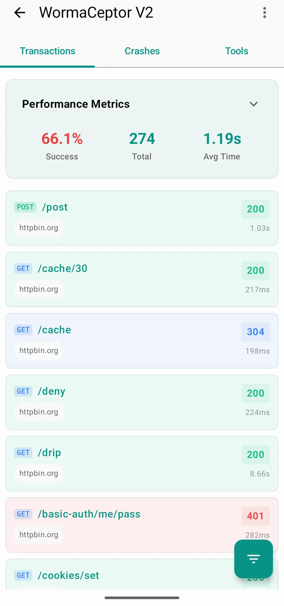
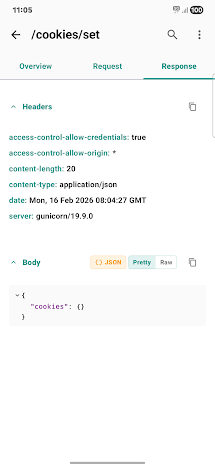
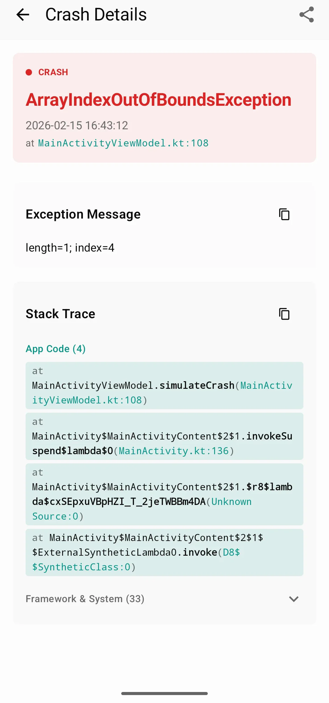
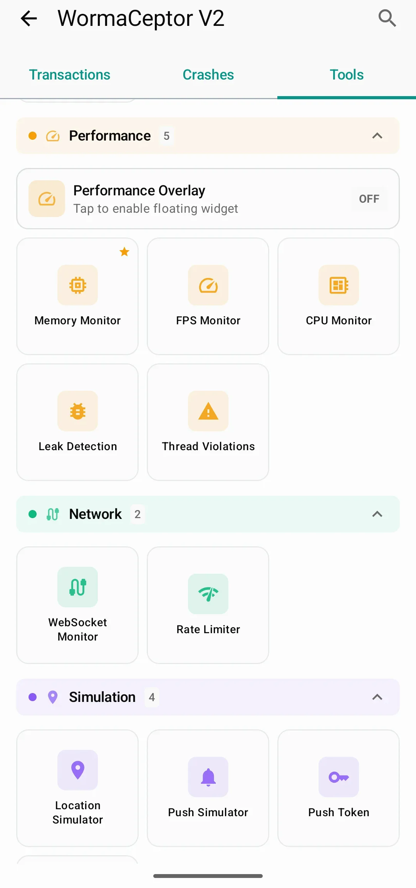

# WormaCeptor V2

[](https://jitpack.io/#azikar24/WormaCeptor)
[](https://opensource.org/licenses/MIT)
[](https://android-arsenal.com/api?level=23)
[](https://kotlinlang.org)
[](https://developer.android.com/jetpack/compose)

### The Clean-Architecture, Production-Safe Network Inspector and Debugging Toolkit for Android

**WormaCeptor V2** is a complete architectural rewrite of the classic network interceptor, now expanded into a comprehensive debugging toolkit. Designed for modularity, safety, and zero-impact production builds, it decouples inspection logic from interception points.

> **New to WormaCeptor?** See the [Setup Guide](docs/SETUP_GUIDE.md) for comprehensive integration instructions covering OkHttp, Ktor, WebView, redaction, feature toggles, and more.

---

## Live Demo

Try WormaCeptor V2 in action with the demo app on the Google Play Store:

<a href="https://play.google.com/store/apps/details?id=com.azikar24.wormaceptorapp"></a>

### Demo Video

[](https://youtube.com/shorts/iSEifbkq7NI)

### Screenshots

<p>
  
  
  
  
</p>

---

## Quick Start

### OkHttp

```kotlin
// build.gradle.kts
dependencies {
    implementation("com.github.azikar24.WormaCeptor:api-client:2.2.0")
    debugImplementation("com.github.azikar24.WormaCeptor:api-impl-persistence:2.2.0")
}
```

```kotlin
// Application.kt
class MyApplication : Application() {
    override fun onCreate() {
        super.onCreate()
        WormaCeptorApi.init(this)
    }
}

// OkHttp setup
val client = OkHttpClient.Builder()
    .addInterceptor(WormaCeptorInterceptor())
    .build()
```

### Ktor

```kotlin
// build.gradle.kts
dependencies {
    implementation("com.github.azikar24.WormaCeptor:api-client:2.2.0")
    debugImplementation("com.github.azikar24.WormaCeptor:api-impl-persistence:2.2.0")
    compileOnly("io.ktor:ktor-client-core:<ktor-version>")
}
```

```kotlin
val client = HttpClient(CIO) {
    install(WormaCeptorKtorPlugin) {
        maxContentLength = 500_000L
        retainDataFor = WormaCeptorKtorConfig.RetentionPeriod.ONE_WEEK
    }
}
```

For detailed integration, see the [Setup Guide](docs/SETUP_GUIDE.md).

---

## Why WormaCeptor V2?

| Problem | Solution |
|---------|----------|
| Traditional inspectors leak into release builds | Physical dependency separation via `debugImplementation` |
| Monolithic architecture couples UI + Logic | Modular design with 50+ independent modules |
| Debug tools can crash production apps | Reflection-based discovery with graceful No-Op fallback |
| Limited to network inspection only | Comprehensive debugging toolkit with 30+ features |

---

## Feature Overview

### Network Inspection
- HTTP/HTTPS traffic capture with headers, body, timing, TLS info
- Request/response body parsing (JSON, XML, HTML, multipart, images, PDFs)
- Syntax highlighting and collapsible tree views
- Search, filter, and favorites
- cURL and JSON export

### HTTP Client Support
- **OkHttp Interceptor**: Full request/response capture with rate limiting
- **Ktor Client Plugin**: Native Ktor integration with same feature set
- **WebView Monitor**: Track WebView page loads and sub-resource requests
- **WebSocket Monitor**: Real-time WebSocket frame inspection

### Performance Monitoring
- **FPS Monitor**: Real-time frame rate tracking with history and jank detection
- **Memory Monitor**: Heap usage with threshold alerts
- **CPU Monitor**: Per-core and overall usage tracking
- **Performance Overlay**: Draggable floating badge showing live FPS, Memory, and CPU metrics

### System Inspection
- **SQLite Browser**: Browse tables and execute custom queries
- **SharedPreferences Inspector**: View and edit preferences
- **Secure Storage Inspector**: View encrypted preferences (EncryptedSharedPreferences)
- **File Browser**: Navigate app file system
- **Device Info**: Comprehensive device and app details
- **Cookies Manager**: View HTTP cookies
- **Loaded Libraries**: List native .so files
- **Dependencies Inspector**: Inspect Gradle dependencies and versions

### Advanced Debugging
- **Leak Detection**: Automatic memory leak detection for Activities/Fragments
- **Thread Violation Detection**: ANR warnings and main thread violations (StrictMode)
- **Crash Reporting**: Integrated exception capture with stack traces
- **Console Logs**: Application log viewer (Logcat)

### Network Simulation
- **Rate Limiter**: Throttle network with presets (2G, 3G, 4G, WiFi) or custom speeds

### Testing Tools
- **Push Notification Simulator**: Send test notifications
- **Push Token Manager**: View and copy FCM/push tokens
- **Location Simulator**: Mock GPS location
- **Crypto Tool**: Encrypt/decrypt with AES, RSA, hashing, and encoding

### UI Debugging
- **Touch Visualizer**: Visualize touch events on screen
- **View Borders**: Highlight view boundaries
- **Grid Overlay**: Display grid overlay for layout alignment
- **Measurement Tool**: Measure screen elements

---

## Architecture

```
[ Your App ]
     |
     +-------+-------+
     |               |
[ OkHttp ]     [ Ktor Client ]
     |               |
     v               v
[ Interceptor ]  [ KtorPlugin ]
     |               |
     +-------+-------+
             |
             v
     ( ServiceProvider Contract )
             |
   +---------+---------+
   | (Dynamic Binding) |
   v                   v
[ No-Op Impl ]    [ Persistence / IMDB ]
  (Release)           (Debug)
                         |
               +---------+---------+
               |         |         |
           [ Core ]  [ Infra ]  [ UI ]
              |          |         |
           Engine   SQLite/Mem  Features
```

### Module Structure

| Layer | Modules | Purpose |
|-------|---------|---------|
| **API** | client, common, impl-persistence, impl-imdb, impl-no-op | Public interface and implementations |
| **Core** | engine | Business logic, monitoring engines, capture/query |
| **Domain** | entities, contracts | Framework-agnostic data models and interfaces |
| **Features** | 31 modules | UI screens for each debugging feature |
| **Infra** | persistence, networking, parsers, syntax | Concrete implementations |
| **Platform** | android | Android-specific utilities (notifications, shake, floating button) |

---

## Installation

### JitPack

Add JitPack repository:

```kotlin
// settings.gradle.kts
dependencyResolutionManagement {
    repositories {
        maven { url = uri("https://jitpack.io") }
    }
}
```

Add dependencies:

```kotlin
dependencies {
    // Required: Lightweight API client (safe for all build types)
    implementation("com.github.azikar24.WormaCeptor:api-client:2.2.0")

    // Debug: Choose one implementation
    debugImplementation("com.github.azikar24.WormaCeptor:api-impl-persistence:2.2.0")  // Room-based (persists across app restarts)
    // OR for in-memory (clears on app kill):
    // debugImplementation("com.github.azikar24.WormaCeptor:api-impl-imdb:2.2.0")

    // Optional: Explicit no-op for release (usually not needed)
    // releaseImplementation("com.github.azikar24.WormaCeptor:api-impl-no-op:2.2.0")
}
```

| Module | Purpose |
|--------|---------|
| `api-client` | Public API facade. Lightweight, safe for `implementation`. |
| `api-impl-persistence` | Room-based storage. Use `debugImplementation`. |
| `api-impl-imdb` | In-memory storage. Clears on process death. Use `debugImplementation`. |
| `api-impl-no-op` | Explicit no-op. Rarely needed since `api-client` auto-discovers. |

---

## Configuration

### Initialization

```kotlin
WormaCeptorApi.init(
    context = applicationContext,
    logCrashes = true,                // Capture uncaught exceptions
    features = Feature.ALL,           // Which features to enable
    leakNotifications = true,         // Show notifications for memory leaks
)
```

### OkHttp Interceptor Options

```kotlin
WormaCeptorInterceptor()
    .showNotification(true)           // System notification for new transactions
    .maxContentLength(500_000L)       // Max body capture size in bytes
    .retainDataFor(Period.ONE_WEEK)   // Auto-cleanup policy
    .redactHeader("Authorization")    // Mask sensitive headers
    .redactHeader("Cookie")
    .redactBody("password\":\".*?\"") // Mask via regex
    .redactJsonValue("token")         // Mask JSON values by key
    .redactXmlValue("apiKey")         // Mask XML values by tag
```

### Global Redaction

```kotlin
WormaCeptorApi.redactionConfig
    .redactHeader("Authorization")
    .redactJsonValue("password")
    .redactXmlValue("apiKey")
    .replacement("[REDACTED]")        // Custom replacement text (default: "********")
```

See the [Setup Guide](docs/SETUP_GUIDE.md) for Ktor configuration, WebSocket/WebView monitoring, and per-interceptor vs global redaction details.

---

## Launching the UI

WormaCeptor provides three ways to open its UI:

| Method | Code | Notes |
|--------|------|-------|
| **Intent** | `startActivity(WormaCeptorApi.getLaunchIntent(context))` | Manual launch |
| **Shake Gesture** | `WormaCeptorApi.startActivityOnShake(activity)` | Lifecycle-aware, auto-stops on destroy |
| **Floating Button** | `WormaCeptorApi.showFloatingButton(context)` | Draggable overlay, requires `SYSTEM_ALERT_WINDOW` |

See the [Setup Guide](docs/SETUP_GUIDE.md#launching-the-ui) for full examples including permission handling.

---

## Deep Links

All deep links use the `wormaceptor://` scheme.

| Deep Link | Destination |
|-----------|-------------|
| `wormaceptor://transactions` | Transactions tab |
| `wormaceptor://crashes` | Crashes tab |
| `wormaceptor://tools` | Tools tab |
| `wormaceptor://tools/memory` | Memory Monitor |
| `wormaceptor://tools/fps` | FPS Monitor |
| `wormaceptor://tools/cpu` | CPU Monitor |
| `wormaceptor://tools/preferences` | SharedPreferences Inspector |
| `wormaceptor://tools/database` | SQLite Browser |
| `wormaceptor://tools/filebrowser` | File Browser |
| `wormaceptor://tools/websocket` | WebSocket Monitor |
| `wormaceptor://tools/location` | Location Simulator |
| `wormaceptor://tools/push` | Push Notification Simulator |
| `wormaceptor://tools/pushtoken` | Push Token Manager |
| `wormaceptor://tools/leaks` | Leak Detection |
| `wormaceptor://tools/threads` | Thread Violation Detection |
| `wormaceptor://tools/webview` | WebView Monitor |
| `wormaceptor://tools/crypto` | Crypto Tool |
| `wormaceptor://tools/ratelimit` | Rate Limiter |
| `wormaceptor://tools/securestorage` | Secure Storage Inspector |
| `wormaceptor://tools/loadedlibraries` | Loaded Libraries |
| `wormaceptor://tools/dependencies` | Dependencies Inspector |
| `wormaceptor://tools/logs` | Console Logs |
| `wormaceptor://tools/deviceinfo` | Device Info |
| `wormaceptor://tools/touchviz` | Touch Visualizer |
| `wormaceptor://tools/viewborders` | View Borders |
| `wormaceptor://tools/gridoverlay` | Grid Overlay |
| `wormaceptor://tools/measurement` | Measurement Tool |

Several routes accept aliases (e.g., `files` for `filebrowser`, `console` for `logs`). See the [Setup Guide](docs/SETUP_GUIDE.md#deep-links) for the full alias table.

---

## Feature Toggles

Enable or disable any of 20 features at initialization:

```kotlin
WormaCeptorApi.init(
    context = this,
    features = setOf(Feature.MEMORY_MONITOR, Feature.DATABASE_BROWSER, Feature.FPS_MONITOR),
)
```

Query feature state at runtime:

```kotlin
WormaCeptorApi.isFeatureEnabled(Feature.LEAK_DETECTION)  // Boolean
WormaCeptorApi.getEnabledFeatures()                      // Set<Feature>
```

Predefined sets: `Feature.ALL`, `Feature.DEFAULT` (= ALL), `Feature.CORE` (logs + device info).

See the [Setup Guide](docs/SETUP_GUIDE.md#feature-toggles) for the complete list of all 20 `Feature` enum values.

---

## Performance Overlay

The draggable overlay shows real-time FPS, Memory, and CPU metrics. Requires `SYSTEM_ALERT_WINDOW` permission.

```kotlin
WormaCeptorApi.showPerformanceOverlay(activity)   // Show overlay
WormaCeptorApi.hidePerformanceOverlay()            // Hide overlay
WormaCeptorApi.isPerformanceOverlayVisible()       // Check visibility
```

---

## Permissions

Some features require additional permissions:

| Permission | Features |
|------------|----------|
| `SYSTEM_ALERT_WINDOW` | Performance Overlay, Floating Button |
| `READ_EXTERNAL_STORAGE` | File Browser (API < 30) |
| `QUERY_ALL_PACKAGES` | Loaded Libraries |
| `ACCESS_FINE_LOCATION` | Location Simulator |
| `POST_NOTIFICATIONS` | Push Simulator (API 33+) |

---

## Best Practices

1. **Initialize Early**: Call `WormaCeptorApi.init()` first in `Application.onCreate()`
2. **Redact Sensitive Data**: Use `redactHeader()`, `redactJsonValue()`, and `redactXmlValue()` for tokens, passwords, PII
3. **Limit Content Size**: Default is 250KB - avoid increasing for large binary downloads
4. **Debug Only**: Always use `debugImplementation` for persistence/imdb modules
5. **Performance Overlay**: Disable in performance-critical scenarios (adds ~1% overhead)
6. **Selective Features**: Disable features you don't need to reduce resource usage

---

## Troubleshooting

| Issue | Solution |
|-------|----------|
| No logs appearing | Verify `debugImplementation` for `api-impl-persistence` or `api-impl-imdb` |
| Release build crashes | Ensure persistence module is NOT in `implementation` or `releaseImplementation` |
| Shake not working | Requires `api-impl-persistence` or `api-impl-imdb` module (disabled in No-Op) |
| Overlay not showing | Grant `SYSTEM_ALERT_WINDOW` permission |
| Ktor requests not captured | Ensure `WormaCeptorApi.init()` is called before creating the HttpClient |
| WebView requests not showing | Use `WormaCeptorWebView.createMonitoringClient()` instead of a plain `WebViewClient` |
| Feature toggles not persisting | Feature set is determined at `init()` time; re-initialize to change |

See the [Setup Guide](docs/SETUP_GUIDE.md#troubleshooting) for expanded troubleshooting.

---

## Technology Stack

| Component | Version |
|-----------|---------|
| Kotlin | 2.0.21 |
| Min SDK | 23 |
| Target SDK | 36 |
| Jetpack Compose | BOM 2024.10.01 |
| Room | 2.6.1 |
| OkHttp | 4.12.0 |
| Koin | 4.0.0 |
| Coroutines | 1.8.1 |

---

## Comparison

| Feature | Traditional Tools | WormaCeptor V2 |
|---------|-------------------|----------------|
| Architecture | Monolithic | Modular (50+ modules) |
| Release Safety | ProGuard rules | Physical dependency separation |
| HTTP Clients | OkHttp only | OkHttp + Ktor + WebView |
| Crash Reporting | Separate library | Integrated and correlated |
| Performance Monitoring | Not included | FPS, Memory, CPU with overlay |
| System Inspection | Limited | SQLite, SharedPrefs, Secure Storage, Files, Cookies |
| Testing Tools | Not included | Push simulator, location mock, crypto tools |

---

## Roadmap

### Implemented
- Network interception with full HTTP inspection (OkHttp + Ktor)
- Performance monitoring (FPS, Memory, CPU) with floating overlay
- System inspection (SQLite, SharedPrefs, Secure Storage, Files)
- Feature toggle system with 20 toggleable features
- Leak detection and thread violation detection
- Rate limiting and network simulation
- WebSocket and WebView monitoring
- Push notification simulation and token management
- Deep link navigation to any tool
- Extension provider system for custom metadata

### Planned
- GraphQL query/mutation parsing
- gRPC/Protobuf native support
- Custom formatter plugins
- CI/CD headless mode for UI tests
- Remote inspection via ADB

---

## Contributing

We welcome PRs. Please respect Clean Architecture boundaries:

| Type | Location |
|------|----------|
| Business logic | `core/engine` |
| Data models | `domain/entities` |
| Interfaces | `domain/contracts` |
| UI screens | `features/*` |
| Storage/Network | `infra/*` |

If your feature adds a heavy library, create a new module.

### Development

```bash
# Build
./gradlew build

# Run demo app
./gradlew :app:installDebug

# Format code
./gradlew spotlessApply

# Static analysis
./gradlew detekt

# Architecture tests
./gradlew :test:architecture:test
```

---

## License

MIT License (c) Abdulaziz Karam
Free for personal and commercial use.
