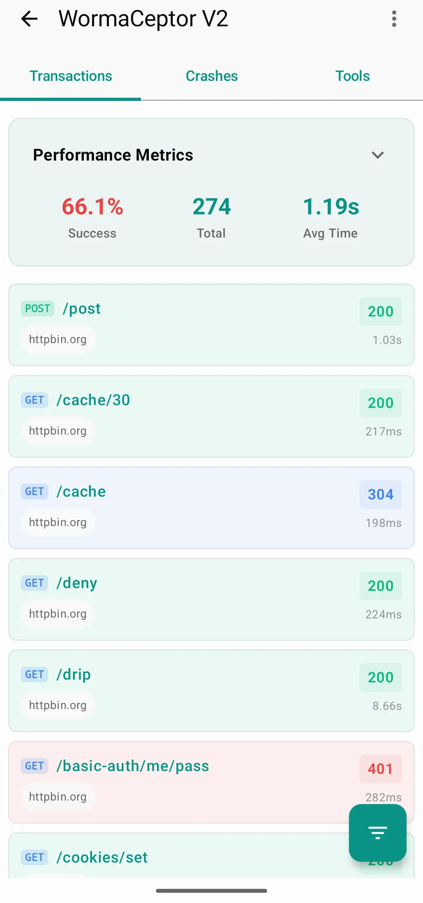
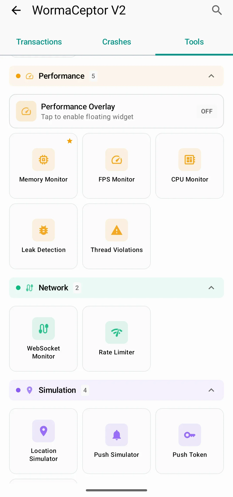
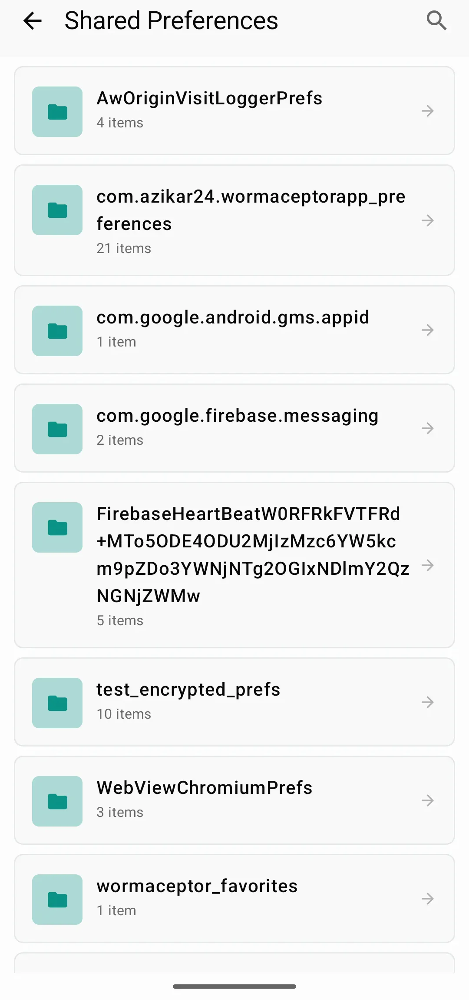
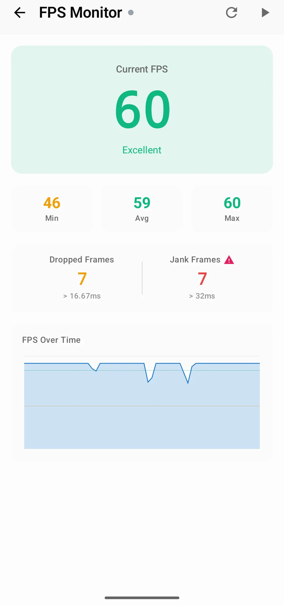

# WormaCeptor

[](https://github.com/azikar24/WormaCeptor)
[](https://jitpack.io/#azikar24/WormaCeptor)
[](https://developer.android.com/about/versions/marshmallow)
[](https://kotlinlang.org)
[](https://developer.android.com/jetpack/compose)
[](LICENSE)

**20 debug tools in one library, zero lines in your release APK.**
Inspect network traffic, monitor performance, browse databases, simulate locations, and more. Ships only in debug builds through Gradle's `debugImplementation`, so nothing reaches production.

## Demo

Network inspection, system tools, and performance monitoring side by side:

<p>
  
  
  
  
</p>

<p align="center">
  <a href="https://play.google.com/store/apps/details?id=com.azikar24.wormaceptorapp"></a>
  <br>
  <a href="https://youtube.com/shorts/iSEifbkq7NI">Watch the demo video</a>
</p>

---

## Quick Start

Add JitPack to your `settings.gradle.kts`:

```kotlin
dependencyResolutionManagement {
    repositories {
        maven { url = uri("https://jitpack.io") }
    }
}
```

Add the dependencies in your app's `build.gradle.kts`:

```kotlin
dependencies {
    implementation("com.github.azikar24.WormaCeptor:api-client:2.2.1")
    debugImplementation("com.github.azikar24.WormaCeptor:api-impl-persistence:2.2.1")
}
```

Initialize in your `Application` class:

```kotlin
import com.azikar24.wormaceptor.api.WormaCeptorApi

class App : Application() {
    override fun onCreate() {
        super.onCreate()
        WormaCeptorApi.init(this)
    }
}
```

Add the interceptor to your OkHttp client:

```kotlin
import com.azikar24.wormaceptor.api.WormaCeptorInterceptor

val client = OkHttpClient.Builder()
    .addInterceptor(WormaCeptorInterceptor())
    .build()
```

Open WormaCeptor from anywhere:

```kotlin
startActivity(WormaCeptorApi.getLaunchIntent(context))
```

You can also enable the shake gesture with `WormaCeptorApi.startActivityOnShake(activity)`. Using Ktor? See the [Ktor guide](https://wormaceptor.com/docs/ktor).

---

## Features

**Network** — Intercept HTTP/HTTPS via OkHttp or Ktor, monitor WebSocket connections and WebView requests, export as cURL or JSON, throttle with the rate limiter

**Performance** — Track FPS, memory, and CPU in real time with a live overlay, catch memory leaks and StrictMode thread violations

**System** — Browse SQLite databases, edit SharedPreferences, inspect encrypted storage, explore files, view loaded native libraries and Gradle dependencies, read device info and logcat, capture crash reports

**Testing** — Fire test push notifications, manage FCM tokens, mock GPS locations, encrypt/decrypt and hash with the crypto tool

Every feature is its own module. Enable exactly what you need at init time, disable the rest. See [Feature Toggles](https://wormaceptor.com/docs/feature-toggles).

---

## How It Works

Your release APK never sees debug code. Here's why:

1. `api-client` ships in all build types. It contains only interfaces and a reflection-based lookup, no debug logic.
2. `api-impl-persistence` (or `api-impl-imdb`) ships only in debug via `debugImplementation`. It registers itself through classpath discovery.
3. In release builds, no implementation exists on the classpath. `api-client` falls back to a no-op automatically. No ProGuard rules, no runtime checks, no dead code.

More details in [No-Op Behavior](https://wormaceptor.com/docs/no-op-behavior).

---

## Redacting Sensitive Data

Strip credentials and PII before they hit the inspector.

```kotlin
val interceptor = WormaCeptorInterceptor()
    .redactHeader("Authorization")
    .redactJsonValue("password")
    .redactXmlValue("apiKey")
    .redactBody("ssn=\\d{3}-\\d{2}-\\d{4}")
```

For global redaction that applies across all interceptors, use `WormaCeptorApi.redactionConfig`. See the [Data Redaction](https://wormaceptor.com/docs/data-redaction) guide.

---

## Documentation

Full docs at **[wormaceptor.com](https://wormaceptor.com)** — [Getting Started](https://wormaceptor.com/docs)

- [Installation & Requirements](https://wormaceptor.com/docs/installation)
- [Ktor Client Plugin](https://wormaceptor.com/docs/ktor)
- [WebSocket Monitoring](https://wormaceptor.com/docs/websocket)
- [WebView Monitoring](https://wormaceptor.com/docs/webview)
- [Launching the UI](https://wormaceptor.com/docs/launching-ui)
- [Performance Overlay](https://wormaceptor.com/docs/performance-overlay)
- [Extension Providers](https://wormaceptor.com/docs/extension-providers)
- [Migrating from Chucker](https://wormaceptor.com/docs/migration/from-chucker)
- [Troubleshooting](https://wormaceptor.com/docs/troubleshooting)

---

## Contributing

PRs welcome. To get started:

```bash
./gradlew build              # Build everything
./gradlew spotlessApply      # Format code
./gradlew :app:installDebug  # Run the demo app
```

---

## License

MIT — see [LICENSE](LICENSE).
