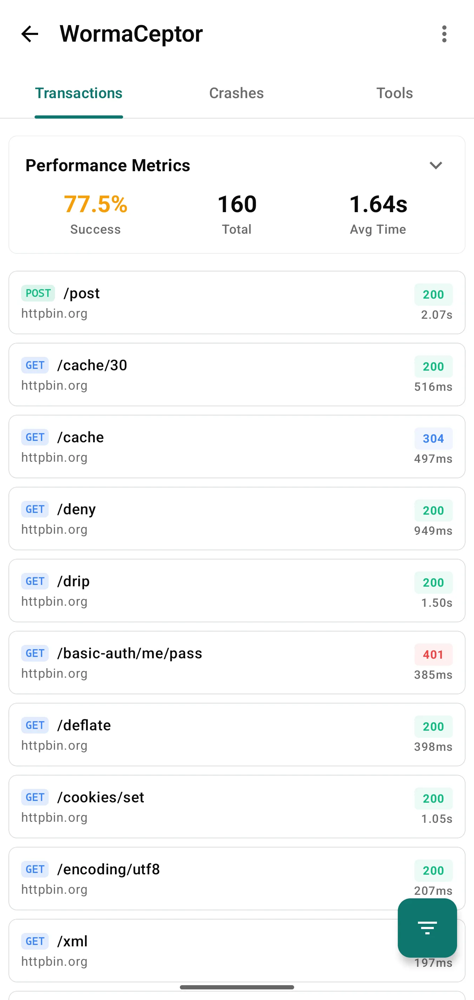
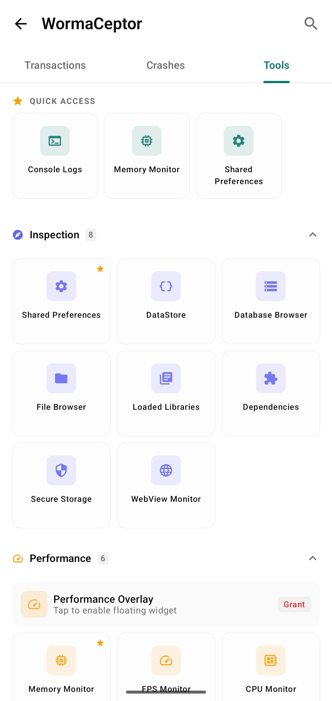
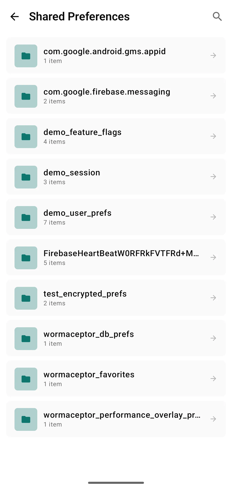
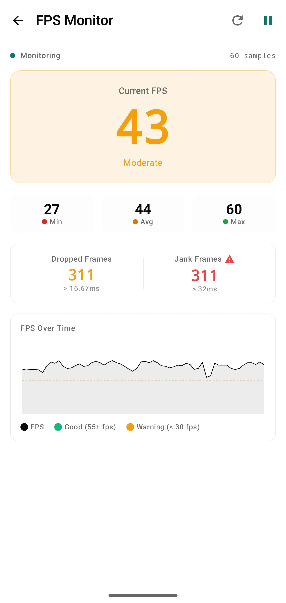

# WormaCeptor

[](https://github.com/azikar24/WormaCeptor)
[](https://central.sonatype.com/artifact/com.azikar24.wormaceptor/wormaceptor-client)
[](https://developer.android.com/about/versions/marshmallow)
[](https://kotlinlang.org)
[](https://developer.android.com/jetpack/compose)
[](LICENSE)

**23 debug tools in one library, zero lines in your release APK.**
Inspect network traffic, monitor performance, browse databases, simulate locations, and more. Ships only in debug builds through Gradle's `debugImplementation`, so nothing reaches production.

## Demo

Network inspection, system tools, and performance monitoring side by side:

<p>
  
  
  
  
</p>

<p align="center">
  <a href="https://play.google.com/store/apps/details?id=com.azikar24.wormaceptorapp"></a>
  <br>
  <a href="https://youtube.com/shorts/iSEifbkq7NI">Watch the demo video</a>
</p>

---

## Quick Start

Make sure `mavenCentral()` is declared in your `settings.gradle.kts` (it's in the default Android template):

```kotlin
dependencyResolutionManagement {
    repositories {
        mavenCentral()
    }
}
```

Add the dependencies in your app's `build.gradle.kts`:

<!-- x-release-please-start-version -->
```kotlin
dependencies {
    implementation("com.azikar24.wormaceptor:wormaceptor-client:2.3.1")
    debugImplementation("com.azikar24.wormaceptor:wormaceptor-persistence:2.3.1")
}
```
<!-- x-release-please-end -->

Initialize in your `Application` class:

```kotlin
import com.azikar24.wormaceptor.api.WormaCeptorApi

class App : Application() {
    override fun onCreate() {
        super.onCreate()
        WormaCeptorApi.init(this)
    }
}
```

Add the interceptor to your OkHttp client:

```kotlin
import com.azikar24.wormaceptor.api.WormaCeptorInterceptor

val client = OkHttpClient.Builder()
    .addInterceptor(WormaCeptorInterceptor())
    .build()
```

Open WormaCeptor from anywhere:

```kotlin
startActivity(WormaCeptorApi.getLaunchIntent(context))
```

You can also enable the shake gesture with `WormaCeptorApi.startActivityOnShake(activity)`. Using Ktor? See the [Ktor guide](https://wormaceptor.com/docs/ktor).

---

## Features

**Network** — Intercept HTTP/HTTPS via OkHttp or Ktor, monitor WebSocket connections and WebView requests, copy URLs or export as cURL, JSON and HAR, throttle with the rate limiter, and mock responses with Mock Rules (turn any captured request into a mock with Add to Mock)

**Performance** — Track FPS, memory, and CPU in real time with a live overlay, catch memory leaks and StrictMode thread violations, spot excessive Compose recompositions

**System** — Browse SQLite databases, edit SharedPreferences, inspect DataStore and encrypted storage, explore files, view loaded native libraries and Gradle dependencies, read device info and logcat, capture crash reports

**Testing** — Fire test push notifications, manage FCM tokens, mock GPS locations, encrypt/decrypt and hash with the crypto tool

**AI agents** — An optional MCP server lets Claude Code, Cursor, and other MCP clients query the running debug app: 42 tools for transactions, crashes, logs, performance, storage, mock rules, request replay, and actions. See [AI Agents (MCP)](#ai-agents-mcp)

Every feature is its own module. Enable exactly what you need at init time, disable the rest. See [Feature Toggles](https://wormaceptor.com/docs/feature-toggles).

---

## How It Works

Your release APK never sees debug code. Here's why:

1. `wormaceptor-client` ships in all build types. It contains only interfaces and a reflection-based lookup, no debug logic.
2. `wormaceptor-persistence` (or `wormaceptor-imdb`) ships only in debug via `debugImplementation`. It registers itself through classpath discovery.
3. In release builds, no implementation exists on the classpath. `wormaceptor-client` falls back to a no-op automatically. No ProGuard rules, no runtime checks, no dead code.

More details in [No-Op Behavior](https://wormaceptor.com/docs/no-op-behavior).

---

## Redacting Sensitive Data

Strip credentials and PII before they hit the inspector.

```kotlin
val interceptor = WormaCeptorInterceptor()
    .redactHeader("Authorization")
    .redactJsonValue("password")
    .redactXmlValue("apiKey")
    .redactBody("ssn=\\d{3}-\\d{2}-\\d{4}")
```

For global redaction that applies across all interceptors, use `WormaCeptorApi.redactionConfig`. See the [Data Redaction](https://wormaceptor.com/docs/data-redaction) guide.

---

## AI Agents (MCP)

Add the MCP device server to your debug build and your AI coding agent can read live app data over [MCP](https://modelcontextprotocol.io/) instead of you pasting logs.

<!-- x-release-please-start-version -->
```kotlin
debugImplementation("com.azikar24.wormaceptor:wormaceptor-mcp-server:2.4.0")
```
<!-- x-release-please-end -->

Build the bridge CLI once (`./gradlew :mcp:bridge:jar` in this repo), then register it with your client:

```bash
claude mcp add --transport stdio wormaceptor -- java -jar /absolute/path/to/bridge.jar
```

The server binds to `127.0.0.1` on the device and the bridge reaches it through `adb forward`. Bearer-token auth is available and off by default; read [Security](docs/MCP.md#security) before using it on a shared device. Setup, all 42 tools, and configuration: [docs/MCP.md](docs/MCP.md). Walkthrough: [docs/MCP_TUTORIAL.md](docs/MCP_TUTORIAL.md).

---

## Documentation

Full docs at **[wormaceptor.com](https://wormaceptor.com)** — [Getting Started](https://wormaceptor.com/docs)

- [Installation & Requirements](https://wormaceptor.com/docs/installation)
- [Ktor Client Plugin](https://wormaceptor.com/docs/ktor)
- [WebSocket Monitoring](https://wormaceptor.com/docs/websocket)
- [WebView Monitoring](https://wormaceptor.com/docs/webview)
- [Launching the UI](https://wormaceptor.com/docs/launching-ui)
- [Performance Overlay](https://wormaceptor.com/docs/performance-overlay)
- [Extension Providers](https://wormaceptor.com/docs/extension-providers)
- [Migrating from Chucker](https://wormaceptor.com/docs/migration/from-chucker)
- [Troubleshooting](https://wormaceptor.com/docs/troubleshooting)

---

## Contributing

PRs welcome. See [CONTRIBUTING.md](CONTRIBUTING.md) for setup, architecture rules and the PR process. To get started:

```bash
./gradlew build              # Build everything
./gradlew spotlessApply      # Format code
./gradlew :app:installDebug  # Run the demo app
```

---

## License

MIT — see [LICENSE](LICENSE).
