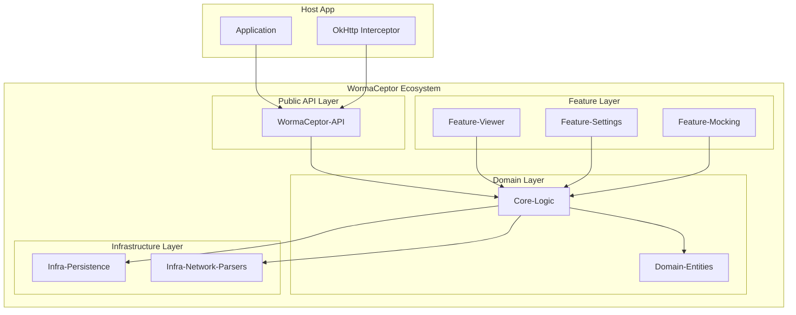

# WormaCeptor v2: Target Architecture (To-Be)

This document defines the architectural blueprint for Wormaceptor v2, optimized for modularity, AI-safety, and zero-trust.

## 1. Architectural Principles
- **Zero-Dependency Core:** The core logic must not depend on UI, database, or network frameworks.
- **Contract-First Communication:** Modules interact via strictly defined interfaces (Contracts).
- **Reactive State Flow:** Use unidirectional data flow (UDF) powered by Kotlin Flows.
- **Anti-Corruption Layers (ACL):** External entity models (OkHttp, Room) must be mapped to internal Domain entities at the boundary.
- **AI-Agent Safety:** Explicit, fine-grained APIs with clear boundaries to prevent agents from unintended side effects.

## 2. Layered Architecture

### 2.1 Core-Logic (The Brain)
- **Role:** Orchestrates business logic (filtering, search logic, session management).
- **Zero Trust:** Validates all incoming data from the Public API and Infrastructure.
- **Decoupling:** Uses dependency inversion for storage and parsing.

### 2.2 Feature Layer (The Face)
- **Role:** Contains Jetpack Compose UI and ViewModels.
- **Constraint:** NO business logic. ViewModels only transform Domain entities into UI state.
- **Isolation:** Features (Viewer, Search, Mocking) are separate modules.

### 2.3 Infrastructure Layer (The Hands)
- **Infra-Persistence:** Implementation of storage contracts (e.g., Room).
- **Infra-Network-Parsers:** Pluggable modules for JSON, XML, Protobuf, etc.

## 3. Extension Points & Plugins
WormaCeptor v2 uses an SPI (Service Provider Interface) pattern for extensibility.

- **Content Parsers:** Register new parsers via `ParserFactory`.
- **Exporters:** Standalone modules implementing `TransactionExporter`.
- **Interceptors:** Support for OkHttp, Ktor, and Cronet via thin adapter layers.

## 4. Communication Patterns
1. **Public API -> Core:** Command-based (e.g., `capture(request)`).
2. **Core -> Infrastructure:** Interface-based (e.g., `TransactionRepository`).
3. **Core -> UI:** Stream-based (e.g., `StateFlow<List<Transaction>>`).

## 5. Metadata & AI Safety
Every internal API call is logged and checked against a `PolicyEngine`.
- **Read-Only Mode:** Ensures AI agents cannot modify transactions unless permitted.
- **Redaction:** Automatic PII masking at the Core layer before storage.
